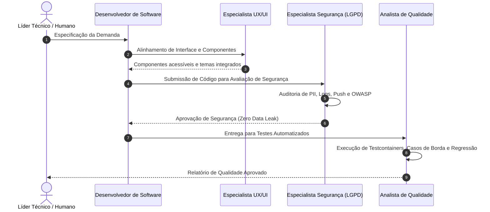

# Catálogo e Orquestração de Agentes: Konnix Chat

Este documento serve como o índice mestre de inteligência e governança para agentes de IA e desenvolvedores que atuam no repositório **Konnix Chat** (Java 21 / Spring Boot 3.5.3 + React 19 / Vite / Tauri / PostgreSQL 16).

---

## 1. Os 4 Especialistas de IA

O time de desenvolvimento do Konnix Chat é composto por 4 agentes especializados, cada um com responsabilidades, ferramentas e critérios de conclusão rigorosos:

| Agente | Arquivo de Especificação | Foco Principal | Gatilho / Invocação |
|---|---|---|---|
| **Desenvolvedor de Software** | [`docs/agents/1-software-developer.md`](file:///Users/sergioo/Documents/GitHub/konnix-chat/docs/agents/1-software-developer.md) | Clean Code, Arquitetura Spring/React, DTOs, Serviços | Implementação de features, refatoração de código, migrações de banco |
| **Analista de Qualidade (QA)** | [`docs/agents/2-qa-analyst.md`](file:///Users/sergioo/Documents/GitHub/konnix-chat/docs/agents/2-qa-analyst.md) | Testes automatizados (JUnit 5, Testcontainers, Vitest), Casos de Borda, Caça de Bugs | Criação de testes, revisão de PRs para cobertura, diagnóstico de falhas |
| **Especialista em UX/UI** | [`docs/agents/3-ux-ui-specialist.md`](file:///Users/sergioo/Documents/GitHub/konnix-chat/docs/agents/3-ux-ui-specialist.md) | Design System (13 temas), Acessibilidade (WCAG 2.1 AA), Responsividade, Componentes Front-End, Desktop Tauri | Ajustes de interface, novos componentes de chat, animações, temas visuais |
| **Especialista em Segurança & Privacidade** | [`docs/agents/4-security-privacy-specialist.md`](file:///Users/sergioo/Documents/GitHub/konnix-chat/docs/agents/4-security-privacy-specialist.md) | **Zero Vazamento de Dados Pessoais (PII)**, Conformidade LGPD, OWASP Top 10, Criptografia, Higiene de Logs & Push | Auditoria de segurança, autenticação/autorização, análise de uploads e logs |

---

## 2. Fluxo de Trabalho Integrado (Pipeline de Entrega)

Para cada nova funcionalidade ou alteração crítica, os agentes devem cooperar segundo o seguinte pipeline:

---

## 3. Documentação de Apoio do Código

Para apoiar as decisões técnicas e manter a integridade da base de código, consulte a documentação técnica modular:

- [Visão Geral da Arquitetura](file:///Users/sergioo/Documents/GitHub/konnix-chat/docs/code/architecture.md): Estrutura em camadas, ciclo de vida das mensagens e protocolos em tempo real.
- [Guia do Backend](file:///Users/sergioo/Documents/GitHub/konnix-chat/docs/code/backend-guide.md): Convenções Spring Boot, repositórios JPA, migrações Flyway e testes de integração com Testcontainers.
- [Guia do Frontend](file:///Users/sergioo/Documents/GitHub/konnix-chat/docs/code/frontend-guide.md): Arquitetura React 19, PWA Service Worker, sistema de temas e suporte desktop Tauri.
- [Design System & UI Kit](file:///Users/sergioo/Documents/GitHub/konnix-chat/docs/code/design-system.md): Tokens CSS (`--konnix-*`), 13 temas visuais e catálogo de componentes `.kx-*` em `docs/tema/`.
- [Referência da API REST](file:///Users/sergioo/Documents/GitHub/konnix-chat/docs/code/api-reference.md): Estrutura do envelope JSON, catálogo de endpoints e códigos de status.
- [Guia de DevOps, CI/CD e Deploys](file:///Users/sergioo/Documents/GitHub/konnix-chat/docs/code/devops-deployment-guide.md): Automação com GitHub Actions, Self-Hosted Runner, Nginx e Cloudflare Tunnel.

---

## 4. Regras Globais Invioláveis

1. **Zero Vazamento de Dados Pessoais (PII)**: Nenhum log, URL, erro ou payload de notificação push pode expor senhas, e-mails, tokens ou mensagens confidenciais.
2. **Envelope de Resposta Padrão**: Toda resposta da API REST deve utilizar `{ success: true, data: ... }` ou `{ success: false, error: { code, message } }`.
3. **Qualidade sem Atalhos**: Nenhuma alteração deve ser finalizada sem testes automatizados determinísticos e compilação limpa (`mvn compile`, `npm run build`).
4. **Sem Abstrações Prematuras**: Aplique Clean Code mantendo a simplicidade e a legibilidade direta para o leitor.
