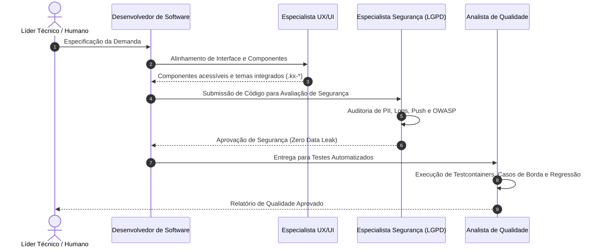

# Catálogo e Orquestração de Agentes: Konnix Chat

Este documento serve como o índice mestre de inteligência, arquitetura e governança para agentes de IA e desenvolvedores que atuam no repositório **Konnix Chat** (Java 21 / Spring Boot 3.5.3 + React 19 / Vite / Tauri 2.x / PostgreSQL 16).

---

## 1. Os 4 Especialistas de IA

O time de desenvolvimento do Konnix Chat é composto por 4 agentes especializados, cada um com responsabilidades, ferramentas e critérios de conclusão rigorosos:

| Agente | Arquivo de Especificação | Foco Principal | Gatilho / Invocação |
|---|---|---|---|
| **Desenvolvedor de Software** | [`docs/agents/1-software-developer.md`](file:///Users/sergioo/Documents/GitHub/konnix-chat/docs/agents/1-software-developer.md) | Clean Code, Arquitetura Spring Boot/React 19, DTOs imutáveis, Serviços transacionais, Migrações Flyway | Implementação de features, refatoração de código, endpoints de API e lógica de negócio |
| **Analista de Qualidade (QA)** | [`docs/agents/2-qa-analyst.md`](file:///Users/sergioo/Documents/GitHub/konnix-chat/docs/agents/2-qa-analyst.md) | Testes automatizados (JUnit 5, Testcontainers, MockMvc, Vitest), Casos de Borda, Caça de Bugs | Criação de testes, revisão de PRs para cobertura, diagnóstico de falhas e concorrência |
| **Especialista em UX/UI** | [`docs/agents/3-ux-ui-specialist.md`](file:///Users/sergioo/Documents/GitHub/konnix-chat/docs/agents/3-ux-ui-specialist.md) | Design System (Konnix System UI), 13 temas visuais, Acessibilidade (WCAG 2.1 AA), Responsividade, Desktop Tauri | Ajustes de interface, novos componentes de chat, animações, temas visuais e painéis |
| **Especialista em Segurança & Privacidade** | [`docs/agents/4-security-privacy-specialist.md`](file:///Users/sergioo/Documents/GitHub/konnix-chat/docs/agents/4-security-privacy-specialist.md) | **Zero Vazamento de Dados Pessoais (PII)**, Conformidade LGPD, OWASP Top 10, Criptografia, Higiene de Logs & Push | Auditoria de segurança, autenticação/autorização, análise de uploads e tokens |

---

## 2. Mapa Funcional Completo do Sistema (Estado Atual)

O Konnix Chat é uma plataforma de comunicação corporativa com os seguintes módulos e funcionalidades ativas:

### 2.1. Experiência de Chat em Tempo Real & Mensageria
- **Salas & Canais**: Canais Públicos (`CHANNEL`), Grupos Privados (`PRIVATE_GROUP`) e Conversas Diretas 1:1 (`DIRECT`).
- **Mensagens Ricas**: Envio de texto com limite de 10.000 caracteres, menções `@usuario`, suporte a markdown e emojis.
- **Mensagens Fixadas (Pin)**: Fixação e desfixação de mensagens cruciais em canais/grupos com banner de destaque no topo da timeline.
- **Enquetes Interativas (Polls)**: Criação de enquetes de escolha única ou múltipla, votação em tempo real, visualização percentual de votos e participantes.
- **Reações com Emoji**: Adição/remoção de emojis em mensagens com contadores reativos e limite de 5 emojis distintos por mensagem.
- **Gravação de Áudio Nativa**: Gravação direta no navegador/desktop com codificação MP3 (`lamejs`), controle de velocidade (1x, 1.5x, 2x), barra de progresso e cancelamento.
- **Respostas & Threads**: Respostas citando mensagem original (`quotedMessage` / `parentMessageId`).
- **Encaminhamento de Mensagens**: Encaminhamento entre salas com badge indicador de origem (`forwardedFromUsername`).
- **Recibos de Leitura (Read Receipts)**: Indicador visual de entrega (✓) e leitura (✓✓), com lista de leitores e configuração de privacidade individual.
- **Indicador de Digitação (Typing Indicator)**: Notificação instantânea via WebSocket com *debounce* inteligente ("fulano está digitando...").
- **Upload & Compartilhamento de Arquivos**: Drag-and-drop e colagem da área de transferência (`Ctrl+V`), preview de imagens com zoom, reprodutor de mídia e validação de tamanho (configurável via `AppSettings`).
- **Busca em Tempo Real**: Filtro de salas na barra lateral e pesquisa textual dentro do histórico da sala ativa.
- **Descoberta de Usuários & Grupos em Comum**: Diretório corporativo com status de presença e visualização de canais/grupos compartilhados entre usuários.
- **Favoritos**: Marcação de conversas diretas e canais favoritos com seção dedicada no topo da barra lateral.

### 2.2. Design System & Nova Identidade Visual (Konnix System UI)
- **13 Temas Visuais**: Suporte nativo a 13 esquemas de cor (`default`, `dark`, `black-gray`, `pink`, `green`, `red`, variações `*-black` e `*-strong`).
- **Zero FOUC (Flash of Unstyled Content)**: Hidratação instantânea do tema via cookie `konnix_theme` antes da montagem do DOM.
- **Catálogo de Componentes `.kx-*`**: Padrões visuais unificados (`.kx-button`, `.kx-card`, `.kx-stat`, `.kx-badge`, `.kx-table`, `.kx-alert`, `.kx-modal`) documentados em `docs/tema/` e `docs/code/design-system.md`.
- **Status de Presença**: Indicadores visuais nos avatares para `online` (verde), `away` (amarelo), `busy` (vermelho), `mission` (azul), `vacation` (roxo) e `offline` (cinza).

### 2.3. Painel Administrativo Completo (`AdminView.tsx`)
- **Gestão de Usuários**: Listagem paginada, criação, edição de perfil, reset de senha, troca obrigatória no primeiro login, papéis (`ADMIN`, `USER`, `BOT`) e status da conta (`ACTIVE`, `READ_ONLY`, `DISABLED`).
- **Gestão de Salas & Membros**: Moderação de canais, ajuste de modo somente-leitura (`readOnly`), adição/remoção de membros e definição de papéis de sala (`OWNER`, `MEMBER`).
- **Trilha de Auditoria (`AuditLog`)**: Consulta paginada de eventos com filtros combinados por Usuário, Ação, Recurso, IP e Intervalo de Datas.
- **Métricas & Monitoramento**: Dashboard com contadores de mensagens, usuários por status, tamanho ocupado por arquivos no disco, tamanho do banco PostgreSQL e gráfico de atividade diária.
- **Tokens de API Pública (`ApiToken`)**: Emissão e revogação de tokens de longa duração com expiração para integrações de sistemas externos e bots.
- **Configurações Gerais (`AppSettings`)**: Customização do nome do sistema e limite de upload de arquivos.
- **Suporte & Diagnóstico**: Visualização e resposta a chamados/relatórios de problemas dos usuários.

### 2.4. Painel Interativo de Documentação da API (`ApiDocsPanel.tsx`)
- Documentação interativa embutida com exemplos de requisição e resposta para todos os endpoints REST e eventos WebSocket.
- Botão para copiar comandos `curl` e exportação instantânea de arquivos `.http` para depuração no VS Code / IntelliJ / Insomnia / Postman.

### 2.5. Cliente Desktop Nativo (Tauri 2.x)
- **Multi-Servidor**: Conexão e alternância entre múltiplas instâncias do Konnix Chat (ex: Homologação, Produção, Servidor Local) com isolamento de tokens de sessão.
- **Recursos Nativos**: Notificações do sistema operacional, autostart no boot, diálogos nativos de arquivos e persistência de dimensões de janela.

### 2.6. CI/CD & Infraestrutura Automatizada
- **Deploy Contínuo**: GitHub Actions Self-Hosted Runner disparado automaticamente por merges em `homologacao` e `main`.
- **Cloudflare Tunnel (`cloudflared`)**: Exposição pública segura com HTTPS automático, zero portas abertas no roteador e compatibilidade Nginx dual-port (80 e 5173).

---

## 3. Fluxo de Trabalho Integrado (Pipeline de Entrega)

Para cada nova funcionalidade ou alteração crítica, os agentes devem cooperar segundo o seguinte pipeline:

---

## 4. Documentação Técnica Modular do Código

Para aprofundar em cada camada do ecossistema, consulte os guias especializados:

- [Visão Geral da Arquitetura](file:///Users/sergioo/Documents/GitHub/konnix-chat/docs/code/architecture.md): Camadas do sistema, modelo de entidades JPA (V1 a V21), ciclo de eventos WebSocket e arquitetura multi-plataforma.
- [Guia do Backend](file:///Users/sergioo/Documents/GitHub/konnix-chat/docs/code/backend-guide.md): Estrutura de pacotes (`api`, `domain`, `service`, `security`, `storage`, `websocket`, `push`), migrações Flyway e testes de integração com Testcontainers.
- [Guia do Frontend](file:///Users/sergioo/Documents/GitHub/konnix-chat/docs/code/frontend-guide.md): React 19, TypeScript estrito, gerenciamento de estado e WebSocket, bridge de plataforma (`platform.ts`), Tauri Desktop e painéis.
- [Design System & UI Kit](file:///Users/sergioo/Documents/GitHub/konnix-chat/docs/code/design-system.md): Tokens CSS (`--konnix-*`), 13 temas visuais, catálogo de componentes `.kx-*` e regras de acessibilidade.
- [Referência da API REST & WebSocket](file:///Users/sergioo/Documents/GitHub/konnix-chat/docs/code/api-reference.md): Envelope JSON padrão, catálogo completo de endpoints (Auth, Rooms, Messages, Polls, Reactions, Admin, Public) e eventos de WebSocket.
- [Guia de DevOps, CI/CD e Deploys](file:///Users/sergioo/Documents/GitHub/konnix-chat/docs/code/devops-deployment-guide.md): Automação com GitHub Actions, Self-Hosted Runner, Nginx e Cloudflare Tunnel.

---

## 5. Regras Globais Invioláveis

1. **Zero Vazamento de Dados Pessoais (PII)**: Nenhum log, URL, resposta de erro, stack trace ou payload de notificação push pode expor senhas, e-mails, tokens ou mensagens confidenciais.
2. **Envelope de Resposta Padrão**: Toda resposta da API REST deve utilizar `{ success: true, data: ... }` ou `{ success: false, error: { code, message } }`.
3. **Qualidade sem Atalhos**: Nenhuma alteração deve ser finalizada sem testes automatizados determinísticos e compilação limpa (`mvn compile`, `npm run build`).
4. **Sem Cores Hardcoded**: Todo novo componente React ou estilo deve consumir exclusivamente os tokens `--konnix-*` e suportar os 13 temas do Konnix System UI.
5. **Sem Abstrações Prematuras**: Aplique Clean Code mantendo a simplicidade e a legibilidade direta para o leitor.
