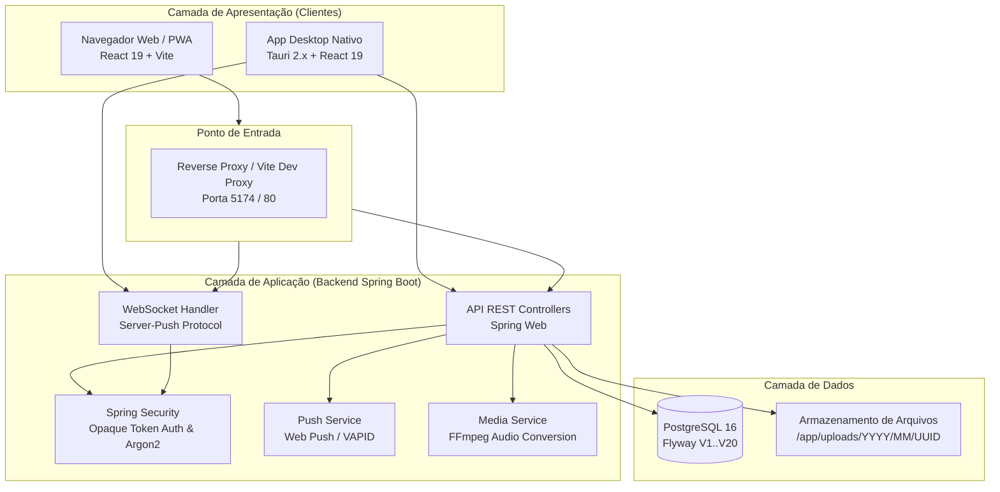

# Arquitetura Geral do Sistema: Konnix Chat

O **Konnix Chat** é uma plataforma corporativa moderna para comunicação em tempo real, estruturada com foco em alta disponibilidade, isolamento de dados, conformidade com a LGPD e suporte multiplataforma (Web, PWA e Desktop).

---

## 1. Visão Arquitetural em Camadas

---

## 2. Modelo de Domínio e Principais Entidades

| Entidade | Descrição |
|---|---|
| `User` | Usuário da plataforma. Contém credenciais (Argon2), papéis (`ADMIN`, `USER`, `BOT`), status de conta (`ACTIVE`, `READ_ONLY`, `DISABLED`), status de presença e preferências de tema. |
| `Room` | Sala de conversação. Tipos: `CHANNEL` (canal público), `PRIVATE_GROUP` (grupo privado) e `DIRECT` (conversa direta 1:1). |
| `RoomMember` | Associação N:N entre usuário e sala com papel local (`OWNER` ou `MEMBER`) e marcação de favoritos. |
| `Message` | Mensagem enviada em uma sala. Tipos: `USER`, `SYSTEM`, `FILE`, `POLL`. Suporta threads (`parent_message_id`), encaminhamento, edição e exclusão lógica (*soft delete*). |
| `MessageReaction` | Reação com emoji em uma mensagem. Limite de até 5 emojis distintos por mensagem. |
| `MessageRead` | Recibos de leitura vinculados à mensagem e ao usuário leitor. |
| `Attachment` | Metadados e hash SHA-256 de arquivos anexados, armazenados no disco por UUID. |
| `Session` | Sessão ativa persistida como hash SHA-256 do token opaco gerado (`knx_...`). |
| `AuditLog` | Trilha de auditoria persistida em transação isolada (`REQUIRES_NEW`). |

---

## 3. Protocolos de Comunicação

### 3.1. REST API (`/api/v1` e `/api/public`)
- **Padrão de Autenticação**: Cabeçalho `Authorization: Bearer <token_opaco>`.
- **Formato de Resposta**:
  - Sucesso: `{ "success": true, "data": ... }`
  - Erro: `{ "success": false, "error": { "code": "STRING_CODE", "message": "Mensagem descritiva" } }`

### 3.2. WebSocket Server-Push (`/ws`)
- **Autenticação**: Query parameter na conexão inicial (`/ws?token=<token_opaco>`).
- **Comportamento**: Apenas *server-push* (mensagens enviadas pelo cliente via WebSocket são descartadas; o cliente publica via API REST).
- **Eventos Principais**:
  - `message.created`: Nova mensagem entregue aos membros da sala.
  - `message.updated` / `message.deleted`: Atualização de conteúdo ou exclusão lógica.
  - `message.reaction`: Adição ou remoção de reações.
  - `message.read`: Notificação enviada exclusivamente ao autor da mensagem.
  - `presence.updated`: Atualização global de presença do usuário (`online`, `away`, `busy`, `offline`, etc.).
