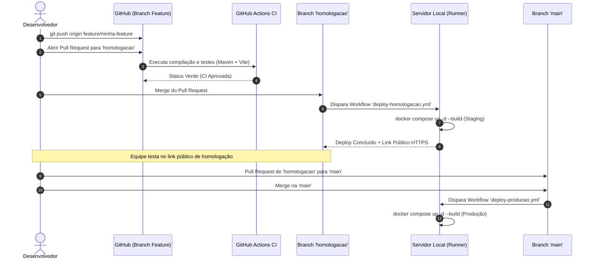

# Guia de DevOps, CI/CD e Deploys Automáticos: Konnix Chat

Este guia documenta a arquitetura de **Integração Contínua (CI)**, **Entrega Contínua (CD)** e **Exposição Pública Segura com HTTPS** implementada no **Konnix Chat**.

---

## 1. Visão Geral da Arquitetura

O sistema de deploy do Konnix Chat transforma qualquer servidor local, máquina de desenvolvimento ou servidor on-premise em um ambiente moderno de **Homologação (Staging)** e **Produção (Prod)** com as seguintes características:

1. **Zero Abertura de Portas**: Não é necessário abrir portas no roteador, configurar DMZ nem possuir IP público fixo.
2. **HTTPS e Certificado SSL Automático**: O tráfego externo é criptografado de ponta a ponta via **Cloudflare Tunnel (`cloudflared`)**.
3. **Deploys Automáticos Disparados pelo GitHub**: Ao mesclar código nas branches `homologacao` ou `main`, o **GitHub Actions Self-Hosted Runner** atualiza e recria os containers automaticamente no servidor.
4. **Nginx Reverse Proxy Otimizado**: Serve a Single Page Application (React 19) compilada em multi-stage build, com compressão Gzip, cache de assets estáticos e proxy reverso para `/api` e `/ws` (WebSocket).

```mermaid
graph TD
    subgraph GitHub ["GitHub Cloud"]
        PR[Pull Request] --> CI[CI: Maven Test + React Build]
        MergeH[Merge na branch 'homologacao'] --> DeployH[Workflow: deploy-homologacao.yml]
        MergeM[Merge na branch 'main'] --> DeployM[Workflow: deploy-producao.yml]
    end

    subgraph ServidorHost ["Servidor Local / Máquina Host"]
        Runner[GitHub Actions Self-Hosted Runner<br/>(Serviço Systemd em Background)]
        
        DeployH -.->|Disparo Seguro| Runner
        DeployM -.->|Disparo Seguro| Runner

        subgraph StagingEnv ["Ambiente de Homologação (Staging)"]
            NginxS[Frontend Nginx :5175]
            BackS[Backend Spring Boot :8082]
            PGS[(Postgres Staging)]
            CFS[Cloudflare Tunnel Staging]
            
            CFS <--> NginxS
            NginxS -->|/api e /ws| BackS
            BackS --> PGS
        end

        subgraph ProdEnv ["Ambiente de Produção (Prod)"]
            NginxP[Frontend Nginx :80]
            BackP[Backend Spring Boot :8080]
            PGP[(Postgres Prod)]
            CFP[Cloudflare Tunnel Prod]
            
            CFP <--> NginxP
            NginxP -->|/api e /ws| BackP
            BackP --> PGP
        end

        Runner -->|docker compose staging| StagingEnv
        Runner -->|docker compose prod| ProdEnv
    end

    subgraph Internet ["Acesso Externo Seguro"]
        Edge[Cloudflare Edge Network<br/>(HTTPS / DDoS Protection / WAF)]
        Users[Desenvolvedores, QAs e Usuários em 4G/5G / Casa]
        
        CFS <-->|Túnel Seguro Outbound| Edge
        CFP <-->|Túnel Seguro Outbound| Edge
        Users <-->|https://...| Edge
    end
```

---

## 2. Ambientes do Sistema

| Ambiente | Branch Git | Docker Compose | Porta Front (Loopback) | Porta Back (Loopback) | Banco Postgres | Acesso Externo |
|---|---|---|---|---|---|---|
| **Desenvolvimento Local** | `feature/*` | `docker-compose.yml` | `5174` (Vite Dev) | `8081` | `konnix` | Rede Local / `localhost` |
| **Homologação (Staging)** | `homologacao` | `deploy/docker-compose.staging.yml` | `127.0.0.1:5175` (Nginx Prod) | `127.0.0.1:8082` | `konnix_staging` | Cloudflare Tunnel (HTTPS) |
| **Produção** | `main` | `deploy/docker-compose.prod.yml` | `127.0.0.1:80` (Nginx Prod) | `127.0.0.1:8080` | `konnix_prod` | Cloudflare Named Tunnel |

> [!IMPORTANT]
> **Políticas de Hardening e Segurança Aplicadas**:
> 1. **Zero Vazamento de Sessão (SEC-01)**: Logs em `/ws` estão desativados no Nginx para evitar gravação de tokens em query strings no disco.
> 2. **Bind em Loopback (SEC-03)**: Portas externas estão atreladas a `127.0.0.1`, impedindo conexões diretas contornando o Nginx e o Cloudflare Tunnel.
> 3. **Contêineres Não-Root (SEC-06)**: O Spring Boot roda sob o usuário sem privilégios `konnix` (UID 1001).
> 4. **Túnel de Produção Autenticado (SEC-05)**: O ambiente de produção exige obrigatoriamente um token de túnel nomeado com domínio corporativo e WAF.

---

## 3. Passo a Passo: Configuração do Servidor Host

Para a máquina que hospedará o servidor receber os deploys automáticos do GitHub, siga os passos abaixo:

### 3.1. Pré-requisitos
Certifique-se de que a máquina possui instalados:
- **Docker Engine** (v24+) e **Docker Compose** (v2.20+)
- **Git**, **curl** e **tar**

> [!TIP]
> No Linux, garanta que seu usuário pode rodar Docker sem `sudo`:
> ```bash
> sudo usermod -aG docker $USER
> newgrp docker
> ```

---

### 3.2. Instalação do GitHub Actions Runner via Script Interativo

Disponibilizamos scripts automatizados multiplataforma que realizam o download com validação de checksum SHA-256, registro do runner e configuração do serviço:

#### No Windows (PowerShell):
1. Abra o **PowerShell** na pasta raiz do projeto:
   ```powershell
   .\deploy\setup-runner.ps1
   ```
   *(Ou passe o token diretamente: `.\deploy\setup-runner.ps1 -Token "SEU_TOKEN_AQUI"`)*

#### No Linux / macOS (Bash):
1. Execute o script interativo:
   ```bash
   ./deploy/setup-runner.sh
   ```

2. Obtenha o token de registro no GitHub:
   - Acesse: **Repositório** -> **Settings** -> **Actions** -> **Runners** -> **New self-hosted runner**.
   - Copie o token exibido na flag `--token <SEU_TOKEN>`.

3. O assistente solicitará:
   - URL do repositório (`https://github.com/Gerabol/konnix-chat`).
   - Token de registro copiado do GitHub.
   - Desejo de registrar como serviço do sistema (Windows Service no Windows / `systemd` no Linux).

Após finalizar, o runner aparecerá com status **Idle / Online** em `Settings -> Actions -> Runners`.

---

## 4. Configuração do Acesso Público HTTPS (Cloudflare Tunnel)

O Cloudflare Tunnel (`cloudflared`) roda diretamente em um container Docker e suporta duas modalidades:

### Opção A: Quick Tunnel Gratuito (Automático / Zero Configuração)
- Não exige cadastro de cartão nem posse de domínio próprio.
- Se a variável `CLOUDFLARE_TUNNEL_TOKEN` estiver vazia no arquivo `.env`, o container iniciará automaticamente em modo Quick Tunnel.
- O link público com terminação HTTPS (`https://*.trycloudflare.com`) será exibido nos logs do container e no resumo do GitHub Actions Step Summary.
- Para visualizar a URL a qualquer momento:
  ```bash
  docker logs --tail=50 konnix-staging-cloudflared
  ```

### Opção B: Named Tunnel Persistente (Domínio Próprio)
Se sua equipe possui um domínio na Cloudflare (ex: `cge.pb.gov.br` ou `konnix.com.br`):
1. Acesse o [Cloudflare Zero Trust Dashboard](https://one.dash.cloudflare.com/).
2. Vá em **Networks** -> **Tunnels** -> **Create a tunnel** (Tipo: *Cloudflared*).
3. Dê um nome ao túnel (ex: `konnix-staging`).
4. Copie o **Tunnel Token**.
5. No passo **Public Hostname**, configure:
   - **Subdomain/Domain**: `chat-staging.seudominio.com.br`
   - **Service Type**: `HTTP`
   - **URL**: `frontend:80` (nome do serviço dentro da rede Docker)
6. Cole o token no arquivo `deploy/.env.staging`:
   ```bash
   CLOUDFLARE_STAGING_TUNNEL_TOKEN=seu_token_jwt_aqui
   ```
7. Reinicie o container:
   ```bash
   docker compose --env-file deploy/.env.staging -f deploy/docker-compose.staging.yml up -d
   ```

---

## 5. Fluxo de Trabalho e Ciclo de Vida do Código (Git Flow)



---

## 6. Comandos Úteis para Operação e Manutenção

### 6.1. Visualizar Containers em Execução
```bash
# Listar containers ativos
docker ps --format "table {{.Names}}\t{{.Status}}\t{{.Ports}}"
```

### 6.2. Visualizar Logs
```bash
# Logs do Backend de Homologação
docker logs -f konnix-staging-backend

# Logs do Frontend / Nginx de Homologação
docker logs -f konnix-staging-frontend

# Logs do Cloudflare Tunnel (ver URL pública)
docker logs -f konnix-staging-cloudflared
```

### 6.3. Backup e Restauração do Banco de Dados
```bash
# Realizar backup do banco de homologação
docker exec -t konnix-staging-postgres pg_dump -U konnix konnix_staging > backup_staging_$(date +%F).sql

# Realizar backup do banco de produção
docker exec -t konnix-prod-postgres pg_dump -U konnix konnix_prod > backup_prod_$(date +%F).sql

# Restaurar backup
cat backup_staging_YYYY-MM-DD.sql | docker exec -i konnix-staging-postgres psql -U konnix -d konnix_staging
```

### 6.4. Parar ou Reiniciar Ambientes Manualmente
```bash
# Parar ambiente de homologação
docker compose --env-file deploy/.env.staging -f deploy/docker-compose.staging.yml down

# Subir ambiente de homologação manualmente
docker compose --env-file deploy/.env.staging -f deploy/docker-compose.staging.yml up -d --build
```

---

## 7. Solução de Problemas (Troubleshooting)

### Erro: `permission denied while trying to connect to the Docker daemon socket`
- **Causa**: O usuário do sistema ou o GitHub Runner não possui permissão para acessar `/var/run/docker.sock`.
- **Solução**:
  ```bash
  sudo usermod -aG docker $USER
  sudo systemctl restart actions.runner.*
  ```

### Erro: Porta já em uso (`bind: address already in use`)
- **Causa**: Outro serviço local está ocupando as portas `5175`, `8082`, `80` ou `8080`.
- **Solução**: Altere as portas no arquivo `deploy/.env.staging` ou `deploy/.env.prod` (ex: altere `STAGING_FRONTEND_PORT=5176`).

### WebSocket não conecta ou desconecta após 60 segundos
- **Causa**: Timeout no proxy reverso ou falta dos cabeçalhos de upgrade.
- **Solução**: O arquivo `deploy/nginx/default.conf` já inclui `proxy_read_timeout 86400s` e suporte a `Upgrade` e `Connection "Upgrade"`. Certifique-se de que os containers foram reconstruídos com `docker compose up -d --build`.
