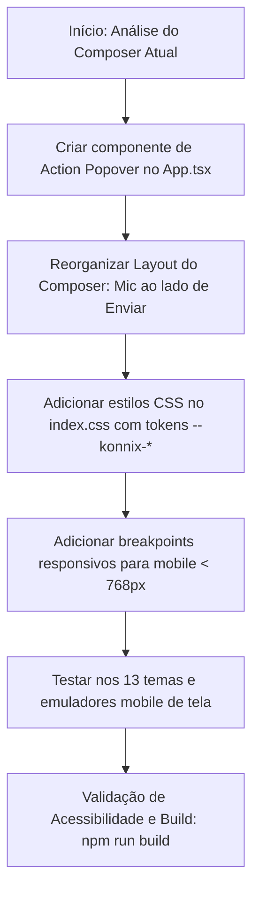

# Especificação de Tarefa: Adaptação e Redesign Mobile / Telas Menores

**Repositório**: Konnix Chat (Java 21 / Spring Boot 3.5.3 + React 19 / Vite / Tauri 2.x / PostgreSQL 16)  
**Módulo Principal**: Front-End Web / PWA / Mobile Responsive  
**Agentes Responsáveis**:
- **Especialista em UX/UI**: [docs/agents/3-ux-ui-specialist.md](file:///c:/Users/cge/Documents/Github/konnix-chat/docs/agents/3-ux-ui-specialist.md)
- **Desenvolvedor de Software**: [docs/agents/1-software-developer.md](file:///c:/Users/cge/Documents/Github/konnix-chat/docs/agents/1-software-developer.md)
- **Analista de Qualidade (QA)**: [docs/agents/2-qa-analyst.md](file:///c:/Users/cge/Documents/Github/konnix-chat/docs/agents/2-qa-analyst.md)

---

## 1. Visão Geral e Objetivo da Demanda

O objetivo desta tarefa é reformular e otimizar a experiência da interface do **Konnix Chat** em **dispositivos móveis e telas menores** (`viewport < 768px` e especialmente `< 480px`), tornando a aplicação mais dinâmica, responsiva, fluida e adaptável ao uso por toque (*touch-friendly*).

### Principais Dores Atuais em Telas Menores:
1. **Poluição visual e quebra no Composer (Barra de Envio)**: Os botões de ação adicionais (`</> Código`, `Anexar`, `Limpar`, `Enquete`) ocupam muito espaço horizontal e vertical na base da tela, espremendo o campo de texto e gerando rolagem ou sobreposição indesejada.
2. **Ergonomia de Toque**: Botões com áreas de clique reduzidas ou difíceis de acionar com uma mão.
3. **Densidade de Espaçamento**: Modais, painéis laterais de arquivos e visualização de perfis necessitam de adaptação em modo *bottom sheet* ou *full-screen drawer*.

---

## 2. Requisitos de UI/UX & Comportamento

### 2.1. Composer Mobile: Menu Circular de Ações Secundárias (Action Box / Popover)

Em telas menores (`@media (max-width: 768px)` ou controle responsivo de tela):

1. **Botão de Ação Circular (`+` / Ações Extras)**:
   - Os botões secundários (`Código`, `Anexar`, `Limpar`, `Enquete`) **devem ser recolhidos** da visualização direta na barra inferior.
   - Em seu lugar, deve ser exibido um botão circular elegante (ex: `.composer-action-trigger` ou `.composer-circle-btn`) estilizado com o Design System Konnix.
   - Ao ser clicado/tocado, esse botão deve abrir um **popover flutuante** ou **action box** ancorado logo acima do botão com animação suave de entrada.

2. **Conteúdo da Action Box (Menu Flutuante)**:
   O menu deve exibir as opções com ícone + rótulo textual legível e touch target mínimo de `44x44px`:
   - 📎 **Anexar Arquivo**: Aciona o seletor de arquivos nativo (`<input type="file" multiple />`).
   - 💻 **Bloco de Código**: Insere ou remove delimitadores de bloco de código (` ``` `) no rascunho.
   - 📊 **Criar Enquete** *(se o tipo da sala for `PRIVATE_GROUP` e o usuário tiver permissão)*: Abre o modal de criação de enquetes.
   - 🗑️ **Limpar Mensagem** *(desabilitado se rascunho/anexos estiverem vazios)*: Limpa o rascunho, anexos pendentes e cancela gravação.
   - ❌ **Cancelar Edição** *(visível apenas quando editando uma mensagem existente)*: Cancela o modo de edição.

3. **Comportamento de Fechamento do Menu**:
   - Fecha automaticamente após a seleção de uma ação.
   - Fecha ao clicar fora do popover (click-outside / backdrop).
   - Fecha ao pressionar a tecla `Escape`.

---

### 2.2. Posicionamento Estratégico do Microfone (Gravação de Áudio)

- **Manter na barra principal**: O botão de gravação de áudio (`AudioRecordButton`) **NÃO** deve ser escondido dentro da caixa de opções.
- **Localização**: Deve permanecer **visível na linha principal de envio**, posicionado **à esquerda do botão de Enviar/Editar** (ou entre o campo de texto e o botão de envio), facilitando o envio rápido de notas de voz com 1 toque.
- **Visual Mobile**: Em telas pequenas, o botão do microfone pode adotar formato circular com ícone (mantendo tooltip/aria-label) para manter a barra compacta e harmoniosa ao lado do botão de envio.

```
+-----------------------------------------------------------------------+
|  [😊 Emoji]  [  Escreva sua mensagem...             ]  [🎤 Mic] [➤ Enviar] |
+-----------------------------------------------------------------------+
|  [ ⊕ Mais Ações ]                                                      |
+-----------------------------------------------------------------------+
                ▲
                │ (Ao clicar no botão ⊕)
        +-----------------------+
        | 📎  Anexar Arquivo    |
        | 💻  Bloco de Código   |
        | 📊  Criar Enquete     |
        | 🗑️  Limpar Mensagem   |
        +-----------------------+
```

---

### 2.3. Outras Melhorias de Responsividade Mobile

1. **Gestão do Teclado Virtual & Viewport**:
   - Utilizar unidades dinâmicas de viewport (`100dvh` ou `calc(100vh - var(--safe-bottom))`) para evitar cortes e distorções causadas pela abertura do teclado virtual no mobile.
   - Suporte a `env(safe-area-inset-bottom)` para dispositivos móveis com barras de gestos (iOS e Android modernos).

2. **Drawer da Barra Lateral (Sidebar)**:
   - Manter a transição suave de abertura/fechamento do drawer da lista de conversas com backdrop escuro (`.sidebar-overlay`).
   - Botão de voltar (`.room-back`) com área de toque generosa no cabeçalho da sala ativa.

3. **Painéis Laterais e Modais**:
   - O painel de arquivos da sala (`.room-files-panel`) deve ocupar 100% da largura em telas móveis (`width: 100%`).
   - Modais (`AddMembersModal`, `UserProfileCard`, `ForwardMessageModal`, `RoomEditModal`, `ReportIssueModal`) devem ter largura máxima fluida (`width: min(94vw, 480px)`), cabeçalho fixo e rolagem interna confortável.

4. **Bolhas de Mensagem e Mídias**:
   - Ajustar `max-width: 90%` ou `94%` para as bolhas em telas `< 480px`.
   - Players de áudio e prévias de anexos devem ser 100% fluidos sem estourar a largura da tela.

---

## 3. Diretrizes Técnicas e de Arquitetura

### 3.1. Design System & Temas (Regra Inviolável)
- **Zero Cores Hardcoded**: Todo componente, borda, fundo, hover ou sombra deve consumir estritamente as variáveis semânticas do Konnix System UI:
  - `--konnix-primary`, `--konnix-primary-hover`, `--konnix-primary-deep`, `--konnix-button`
  - `--konnix-bg`, `--konnix-surface`, `--konnix-ink`, `--konnix-ink-soft`, `--konnix-border`
  - `--konnix-danger`, `--konnix-ok`, `--konnix-warning`
  - `--konnix-shadow`, `--r`, `--rl`
- **13 Temas Visuais**: A action box e todos os botões móveis devem ser testados e funcionar perfeitamente em todos os 13 temas (`default`, `dark`, `black-gray`, `pink`, `green`, `red`, `*-black`, `*-strong`).

### 3.2. Acessibilidade (WCAG 2.1 AA)
- Todos os botões de ícone devem possuir `aria-label` e `title` descritivos.
- O menu flutuante deve possuir `role="menu"` ou `role="dialog"` com `aria-expanded` indicando seu estado.
- Navegação por teclado com foco automático e suporte à tecla `Escape` para fechar.
- Área de toque mínima de `44x44px` para todos os botões móveis.

---

## 4. Arquivos Impactados

| Arquivo | Descrição das Alterações |
|---|---|
| [`frontend/src/App.tsx`](file:///c:/Users/cge/Documents/Github/konnix-chat/frontend/src/App.tsx) | - Criação do estado e componente do menu de ações circular (`action box`).<br>- Reorganização da linha do composer para posicionar o microfone ao lado do botão de envio.<br>- Renderização condicional ou responsiva das ações secundárias. |
| [`frontend/src/index.css`](file:///c:/Users/cge/Documents/Github/konnix-chat/frontend/src/index.css) | - Estilização da `.composer-action-box` / `.composer-actions-popover`.<br>- Regras de layout responsivo sob `@media (max-width: 768px)` e `@media (max-width: 480px)`.<br>- Ajustes de touch target e variáveis de safe-area. |

---

## 5. Plano de Implementação Sugerido



### Passo a Passo:
1. **Estruturar o Menu de Ações**:
   - Extrair ou encapsular as ações secundárias (`Código`, `Anexar`, `Enquete`, `Limpar`, `Cancelar Edição`) em um componente modular com controle de abertura/fechamento e detector de clique externo.
2. **Ajustar a Linha Principal do Composer**:
   - Manter o botão de Emoji à esquerda do input.
   - Textarea autoexpansível no centro.
   - Agrupar o `AudioRecordButton` e o botão de envio (`send-btn`) à direita com alinhamento vertical central.
3. **Criar a Camada de Estilos Responsivos**:
   - No desktop: manter opções acessíveis de forma limpa.
   - No mobile (`<= 768px`): exibir o botão circular de mais opções `+` que dispara a caixa suspensa.
4. **Validar Safe Areas e Teclado**:
   - Testar o comportamento com o painel de emojis aberto e ao colar mídias.

---

## 6. Critérios de Aceitação & Checklist de QA

- [ ] **Menu Circular Funcional**: Em telas menores (`<= 768px`), as ações de Código, Anexar, Enquete e Limpar ficam recolhidas no botão circular e abrem a caixa de seleção ao clicar.
- [ ] **Microfone Visível e Operacional**: O botão de gravação de áudio permanece na barra principal à esquerda do botão de enviar e funciona normalmente com apenas 1 toque.
- [ ] **Envio sem Interrupção**: O botão de envio continua responsivo e habilitado conforme a digitação ou anexos presentes.
- [ ] **Compatibilidade de Temas**: Todos os novos elementos respeitam os 13 temas visuais sem cores fixas no código CSS/JSX.
- [ ] **Acessibilidade**: Suporte a leitor de tela (rótulos `aria-*`), foco visível e fechamento com `Escape`.
- [ ] **Build Limpo**: Compilação sem avisos ou erros (`npm run build` na pasta `frontend`).
